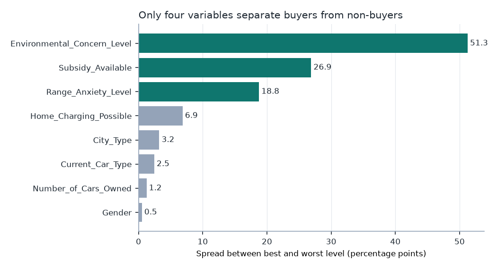
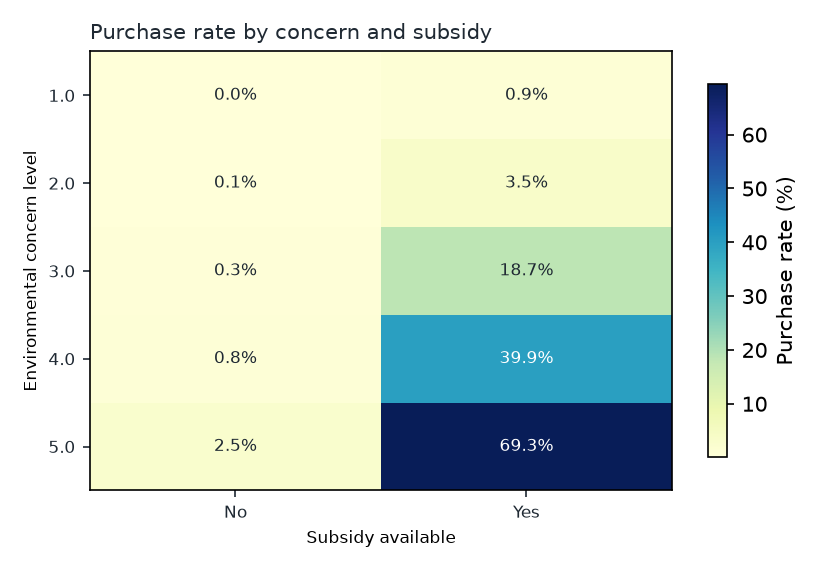
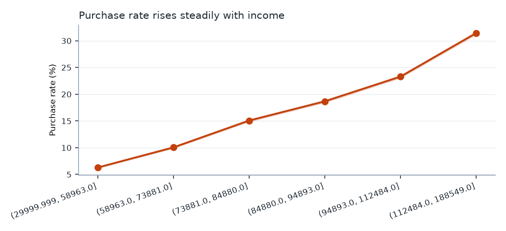
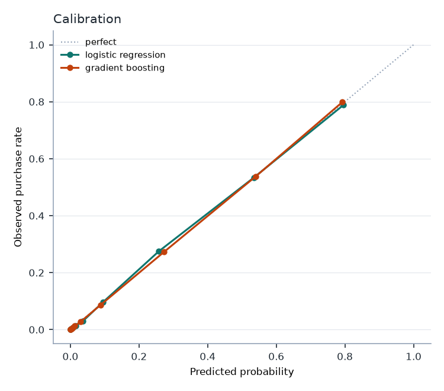
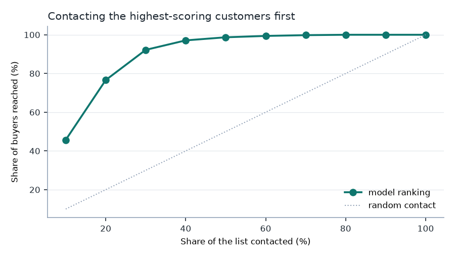

# Điều gì thực sự quyết định việc mua xe điện

Phân tích dữ liệu cuộc thi Kaggle
[Predicting Electric Vehicle Purchases](https://www.kaggle.com/competitions/playground-series-s6e9)
(Playground Series S6E9) — 668.665 hồ sơ khách hàng, trong đó 17,46% quyết định mua.

*English: [README.md](README.md)*

**Cũng được đăng dưới dạng notebook Kaggle:**
[What actually decides an EV purchase](https://www.kaggle.com/code/minhngle/what-actually-decides-an-ev-purchase)
— cùng phân tích, tự chứa và chạy được trực tiếp trên dữ liệu cuộc thi.

Cuộc thi yêu cầu dự đoán một xác suất. Bài này không viết theo hướng leo bảng xếp
hạng, mà đặt câu hỏi của một hãng xe: **ai là người mua xe điện, điều gì thực sự
tác động đến quyết định đó, và nên chi tiền tiếp cận nhóm nào?**

> **Dữ liệu là dữ liệu tổng hợp.** Kaggle sinh ra nó từ một mô hình huấn luyện
> trên khảo sát thật về hành vi mua xe điện; phân bố các biến gần giống nhưng
> không trùng bản gốc. Không có kết luận nào ở đây mô tả thị trường xe điện thật,
> và mục [Giới hạn](#giới-hạn-của-phân-tích-này) chỉ rõ những chỗ dữ liệu hành xử
> khác thị trường thật. Dữ liệu cấp phép CC BY 4.0.

---

## Những gì phân tích tìm ra

**1. Chỉ bốn biến quyết định. Phần còn lại là nhiễu đội lốt tín hiệu.**



| Biến | Cramér's V | p-value | Kết luận |
|---|---|---|---|
| Mức quan tâm môi trường | 0,497 | < 1e-300 | rất mạnh |
| Có trợ cấp | 0,342 | < 1e-300 | rất mạnh |
| Lo ngại quãng đường | 0,116 | < 1e-300 | trung bình |
| Sạc được tại nhà | 0,084 | < 1e-300 | yếu |
| Loại khu vực sống | 0,033 | 5e-162 | không đáng kể |
| Loại xe đang dùng | 0,016 | 2e-37 | không đáng kể |
| Số xe đang sở hữu | 0,009 | 6e-12 | không đáng kể |
| Giới tính | 0,007 | **6,7e-08** | không đáng kể |

Giới tính *có ý nghĩa thống kê* ở mức p = 0,000000067 — và hoàn toàn vô dụng,
chênh lệch giữa các nhóm chỉ 0,53 điểm phần trăm. Với 668.665 dòng, kiểm định ý
nghĩa sẽ gắn nhãn "có ý nghĩa" cho gần như mọi thứ. **p-value cho biết chênh lệch
là có thật; chỉ có kích thước hiệu ứng mới cho biết nó có đáng quan tâm không.**
Mọi bảng trong repo này đều báo cáo cả hai, vì chỉ báo cáo cái đầu là cách một
bài phân tích đi đến chỗ đề xuất chiến dịch nhắm theo giới tính — một chiến dịch
không đem lại gì.

**2. Cái tương tác không hề tồn tại — và nó đã lật ngược kết luận.**

Bảng chéo nhìn rất thuyết phục. Trong nhóm quan tâm môi trường cao nhất, 69,3%
mua khi có trợ cấp và chỉ 2,5% mua khi không có:



Cách đọc hiển nhiên là trợ cấp **nhân lên** tác dụng của mọi yếu tố khác — rằng
nó là một cánh cổng chứ không phải một yếu tố. Đó là kết luận đầu tiên rút ra ở
đây, và nó sai.

Kiểm định tỷ số hợp lý cho số hạng tương tác trợ cấp × quan tâm môi trường cho
**LR = 7,2 với 9 bậc tự do, p = 0,62**. Pseudo-R² McFadden là 0,4574 khi có
tương tác và 0,4574 khi không có. Số hạng đó không mang lại gì.

Kiểm chứng trực tiếp: mô hình logistic **chỉ có hiệu ứng chính** tái tạo mọi ô
của bảng đó với sai lệch tối đa 0,12 điểm phần trăm.

| Mức quan tâm | Quan sát (không trợ cấp) | Dự đoán | Quan sát (có trợ cấp) | Dự đoán |
|---|---|---|---|---|
| 1 | 0,02% | 0,01% | 0,94% | 0,94% |
| 3 | 0,30% | 0,27% | 18,66% | 18,68% |
| 5 | 2,48% | 2,60% | 69,33% | 69,29% |

Hai yếu tố tác động **độc lập** — trên thang odds. Cái hình ảnh kịch tính kia
chính là hình dạng mà các hiệu ứng nhân độc lập luôn tạo ra trên thang **xác
suất** khi một nhóm xuất phát từ gần 0: nhân odds 0,1% với 30 thì vẫn gần 0,
nhân odds 30% với 30 thì chạm trần.

Điều này có ý nghĩa thương mại. "Trợ cấp mở khóa cho sở thích môi trường" và
"trợ cấp và sở thích môi trường mỗi thứ đều có tác dụng, độc lập nhau" dẫn tới
hai chính sách khác nhau. Cách hiểu thứ nhất bảo chỉ nên nhắm vào vùng có trợ
cấp; cách thứ hai nói rằng vùng không có trợ cấp nhưng có khách quan tâm môi
trường và thu nhập cao vẫn đáng tiếp cận, chỉ là tỷ lệ chuyển đổi thấp hơn.

**3. Thu nhập là yếu tố liên tục mạnh nhất, và nó tăng đều chứ không có ngưỡng.**



Từ 6,3% ở nhóm thu nhập thấp nhất lên 31,4% ở nhóm cao nhất — chênh 25 điểm,
không có ngưỡng gãy ở đâu cả. Trong dữ liệu này không tồn tại mức thu nhập mà
tại đó xe điện đột nhiên trở nên vừa túi tiền; xu hướng mua chỉ đơn giản là tăng dần.

**4. Hạ tầng trạm sạc gần như không tác động — và đây là chỗ không nên tin dữ liệu.**

| Biến | Chênh lệch giữa 6 nhóm |
|---|---|
| Thu nhập năm | 25,1 điểm |
| Quãng đường đi làm | 5,2 điểm |
| Trạm sạc gần nhà | 3,1 điểm |
| Tuổi | 2,7 điểm |
| Trạm sạc gần chỗ làm | 1,7 điểm |

Hai trong số này trái ngược với hiểu biết về thị trường xe điện thật. Khả năng
tiếp cận trạm sạc gần nhà là một trong những yếu tố quyết định được trích dẫn
nhiều nhất trong tài liệu nghiên cứu, còn ở đây nó chỉ làm tỷ lệ mua dịch chuyển
3 điểm — và nhóm có **nhiều** trạm sạc nhất lại có tỷ lệ mua hơi **thấp** hơn.
Đi làm xa cũng làm giảm khả năng mua, trong khi thực tế đi càng xa thì tiền
nhiên liệu tiết kiệm được càng lớn, tức xe điện càng nhanh hoàn vốn.

Biến `Home_Charging_Possible` thì lại hành xử hợp lý (19,6% so với 12,7%). Nghĩa
là bộ sinh dữ liệu có mô hình hóa *việc bạn có sạc được ở nhà không*, nhưng không
mô hình hóa *quanh đó có bao nhiêu trạm sạc công cộng*. Ai dùng dữ liệu này để
tranh luận về việc triển khai trạm sạc là đang tranh luận dựa trên một lỗi kỹ
thuật của bộ sinh.

**5. Mô hình giải thích được chỉ kém mô hình không giải thích được 0,3%.**

Kiểm định chéo 5 lớp, chấm trên dự đoán ngoài lớp huấn luyện:

| Mô hình | ROC-AUC | Average precision | Brier |
|---|---|---|---|
| Hồi quy logistic | 0,9381 | 0,7411 | 0,0736 |
| Gradient boosting | **0,9411** | **0,7533** | **0,0716** |

Không báo cáo accuracy, vì đoán "không ai mua" đã đạt 82,5% trên dữ liệu này —
một mô hình vô dụng. Báo cáo average precision vì nó nhạy với nhóm thiểu số 17%,
và báo cáo Brier vì đầu ra được dùng như một xác suất chứ không phải một nhãn.



Gradient boosting thắng 0,003 AUC. Trong bối cảnh kinh doanh, chênh lệch đó không
đủ để đánh đổi lấy việc mất khả năng giải thích **vì sao** một khách hàng được
chấm điểm như vậy — nên mô hình nên triển khai là hồi quy logistic. Hệ số của nó
đọc thẳng ra thành tỷ số odds; với biến số, là trên mỗi độ lệch chuẩn:

| Yếu tố | Tỷ số odds | Cách đọc |
|---|---|---|
| Có trợ cấp | **91,4** | so với không trợ cấp |
| Lo ngại quãng đường: Thấp | **29,3** | so với lo ngại Cao |
| Mức quan tâm môi trường | **6,5** | mỗi 1 độ lệch chuẩn (1,4 mức) |
| Thu nhập năm | 2,07 | mỗi 1 độ lệch chuẩn (28.648 USD) |
| Sạc được tại nhà | 1,26 | so với không sạc được |
| Tất cả biến còn lại | 0,91 – 1,07 | không đáng để hành động |

**6. Giá trị thực tế: liên hệ 10% khách điểm cao nhất là chạm tới 46% người mua.**



| Liên hệ nhóm đầu… | Chạm được bao nhiêu người mua | Tỷ lệ mua trong nhóm | Hiệu quả so với chọn ngẫu nhiên |
|---|---|---|---|
| 10% | 45,7% | 79,9% | **4,6×** |
| 20% | 76,6% | 66,9% | 3,8× |
| 30% | 92,2% | 53,7% | 3,1× |
| 50% | 98,7% | 34,5% | 2,0× |

Đây mới là con số mà ngân sách marketing thực sự được duyệt dựa trên. Liên hệ 30%
danh sách có điểm cao nhất là chạm tới 92% tổng số người sẽ mua: 70% còn lại của
danh sách chỉ chứa 8% người mua, và đuổi theo họ tốn nhiều hơn thu về.

---

## Hãng xe nên làm gì với kết quả này

1. **Sàng lọc theo điều kiện hưởng trợ cấp trước tiên.** Đây là số hạng lớn nhất
   trong mô hình, và biết được trước cả khi tiếp cận khách. Đừng dồn ngân sách
   vào nơi không áp dụng trợ cấp — nhưng cũng đừng loại bỏ hẳn những vùng đó:
   kết luận 2 cho thấy sở thích môi trường vẫn phát huy tác dụng ở đó, chỉ là
   tỷ lệ thấp hơn.
2. **Chấm điểm rồi cắt danh sách ở mốc 30%.** Chạm 92% người mua với 30% chi phí
   tiếp cận là lợi ích vận hành rõ ràng nhất rút ra được.
3. **Hỏi về lo ngại quãng đường ngay từ đầu.** Tỷ số odds 29 lần giữa nhóm lo
   ngại thấp và cao, trên một câu hỏi mà nhân viên bán hàng chỉ cần hỏi miệng,
   khiến đây là câu sàng lọc rẻ nhất có thể có.
4. **Ngừng phân khúc theo giới tính, số xe sở hữu hay loại xe đang dùng.** Cả ba
   đều có ý nghĩa thống kê và vô giá trị về mặt thương mại.
5. **Không dùng dữ liệu này để hoạch định vị trí trạm sạc.** Xem kết luận 4.

## Bảng xếp hạng, để tham chiếu

Bài nộp đạt **0,94087** ROC-AUC công khai — **hạng 398/471**, dưới trung vị
0,94184. Đó là `HistGradientBoostingClassifier` trên mười ba đặc trưng thô,
không tạo thêm đặc trưng và không dò siêu tham số, được chọn thay cho hồi quy
logistic (0,93809) và bản trộn theo hạng (0,94040) dựa trên điểm ngoài lớp huấn
luyện. Kiểm định chéo dự báo 0,94133, bảng xếp hạng trả về 0,94087 — tức khâu
kiểm định là trung thực dù mô hình đơn giản.

Đáng lưu ý thứ hạng đó có nghĩa gì: khoảng cách từ hạng 1 (0,94644) xuống phân
vị 25 (0,94138) chỉ là **0,005 AUC**. Dải cạnh tranh còn hẹp hơn khoảng cách
giữa "giới tính có ý nghĩa" và "giới tính vô dụng" — một phân biệt quyết định
việc ngân sách marketing có bị ném đi hay không. Bảng xếp hạng và bài phân tích
trả lời hai câu hỏi khác nhau, và notebook này được viết cho câu hỏi thứ hai.

## Giới hạn của phân tích này

- **Dữ liệu tổng hợp.** Do Kaggle sinh ra từ mô hình của một khảo sát thật. Nó
  chỉ đủ để kết luận về *bộ dữ liệu này*; muốn suy rộng ra thị trường thật thì
  phải dùng khảo sát gốc.
- **Quan sát, không phải nhân quả.** Điều kiện hưởng trợ cấp không được phân bổ
  ngẫu nhiên. Tỷ số odds 91 lần là một mối liên hệ. Trợ cấp có thể thật sự gây ra
  quyết định mua, nhưng dữ liệu này không tách được điều đó khỏi khả năng các
  vùng có trợ cấp còn khác biệt ở nhiều mặt khác.
- **Tỷ lệ nền gần bằng 0 là không thực tế.** Chỉ 0,58% khách không có trợ cấp
  mua xe. Thị trường thật luôn có những người mua bất kể chính sách hỗ trợ; con
  số tuyệt đối đến vậy là đặc tính của bộ sinh dữ liệu.
- **Không có chiều thời gian.** Không có ngày mua, nên không nói được gì về tính
  mùa vụ, biến động giá, hay tác động khi một chính sách trợ cấp được ban hành
  hoặc bị rút.
- **Không có nhãn của tập test.** Mọi chỉ số đều từ kiểm định chéo trên tập
  huấn luyện. Bài này không tuyên bố thứ hạng nào trên bảng xếp hạng.

## Ghi chú phương pháp

- **Dự đoán ngoài lớp huấn luyện qua kiểm định chéo**, không dùng một tập giữ lại
  duy nhất: mọi dòng đều đóng góp vào ước lượng, và không dòng nào bị chấm bởi mô
  hình đã nhìn thấy nó.
- **Khoảng tin cậy Wilson** cho mọi tỷ lệ. Nhóm lo ngại quãng đường cao mua ở tỷ
  lệ 0,14% trên 2.194 dòng; xấp xỉ chuẩn thông thường sẽ đẩy một phần khoảng tin
  cậy xuống dưới 0.
- **Cramér's V đi kèm mọi p-value**, vì lý do đã nêu ở kết luận 1.
- **Tương tác được kiểm định, không phải nhìn bằng mắt** — và chính điều đó đã
  lật ngược kết luận ban đầu.

## Chạy thử

```bash
python -m venv .venv && source .venv/bin/activate
pip install -r requirements.txt

# Cần token API Kaggle và đã chấp nhận điều khoản cuộc thi.
python scripts/fetch_data.py

python scripts/run_analysis.py        # bảng, biểu đồ, reports/results.json
python -m pytest tests -q
```

Thêm `--sample 100000` để huấn luyện mô hình trên một tập con cho nhanh.
`--no-model` bỏ qua phần mô hình và chỉ chạy phân tích mô tả trong vài giây.

Repo không commit file CSV gốc. Giấy phép cho phép làm vậy, nhưng một repo dễ tin
cậy hơn khi dữ liệu đầu vào đến thẳng từ nguồn.

## Dữ liệu và giấy phép

Dữ liệu: [Playground Series S6E9](https://www.kaggle.com/competitions/playground-series-s6e9),
cấp phép CC BY 4.0, lấy cảm hứng từ bộ dữ liệu hành vi chấp nhận xe điện.
Mã nguồn trong repo này: MIT, xem [LICENSE](LICENSE).
